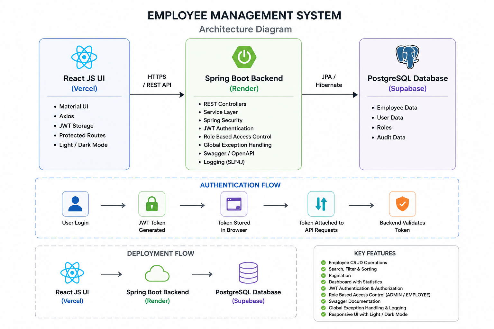
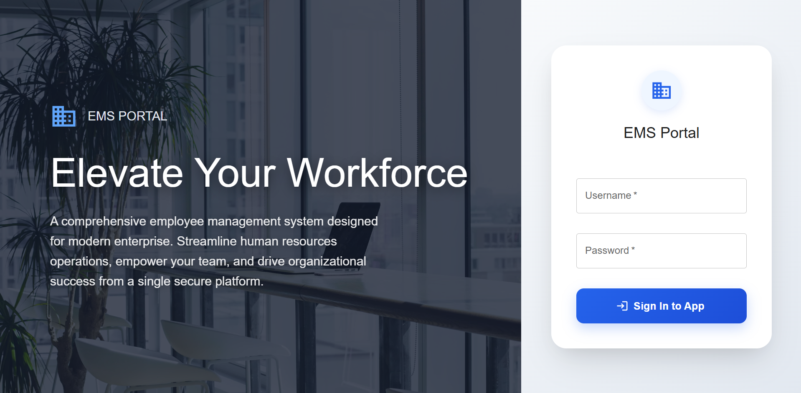
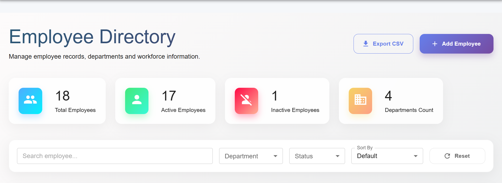
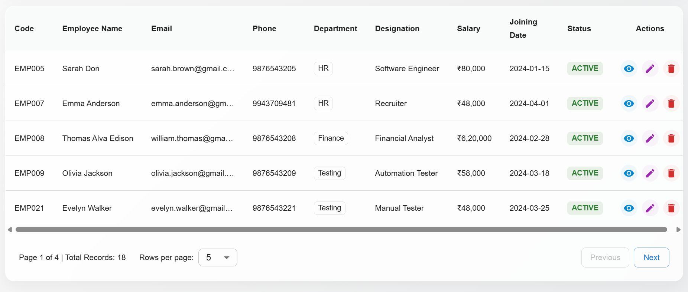
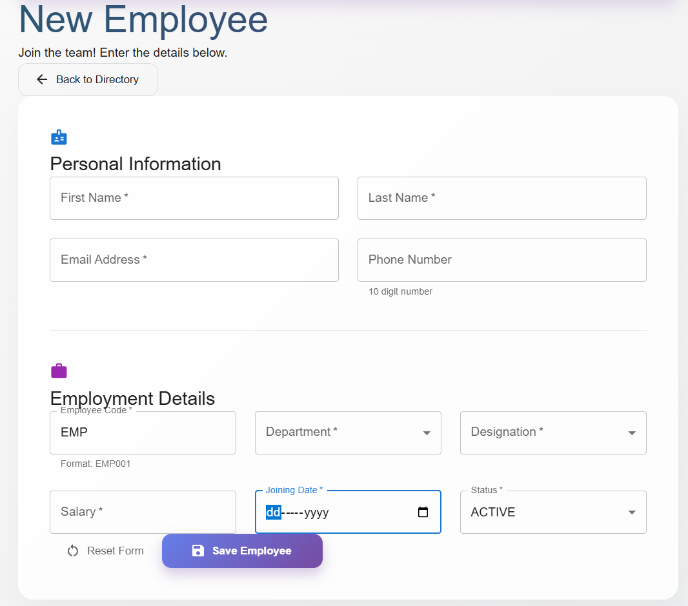
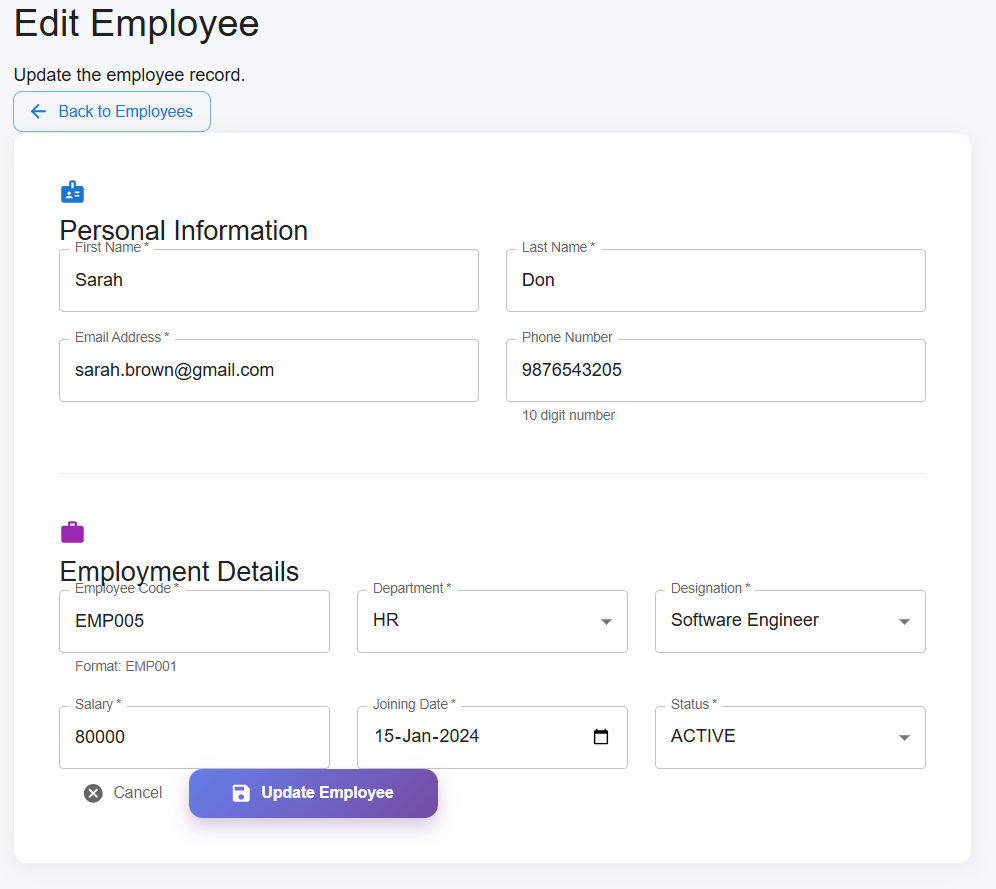
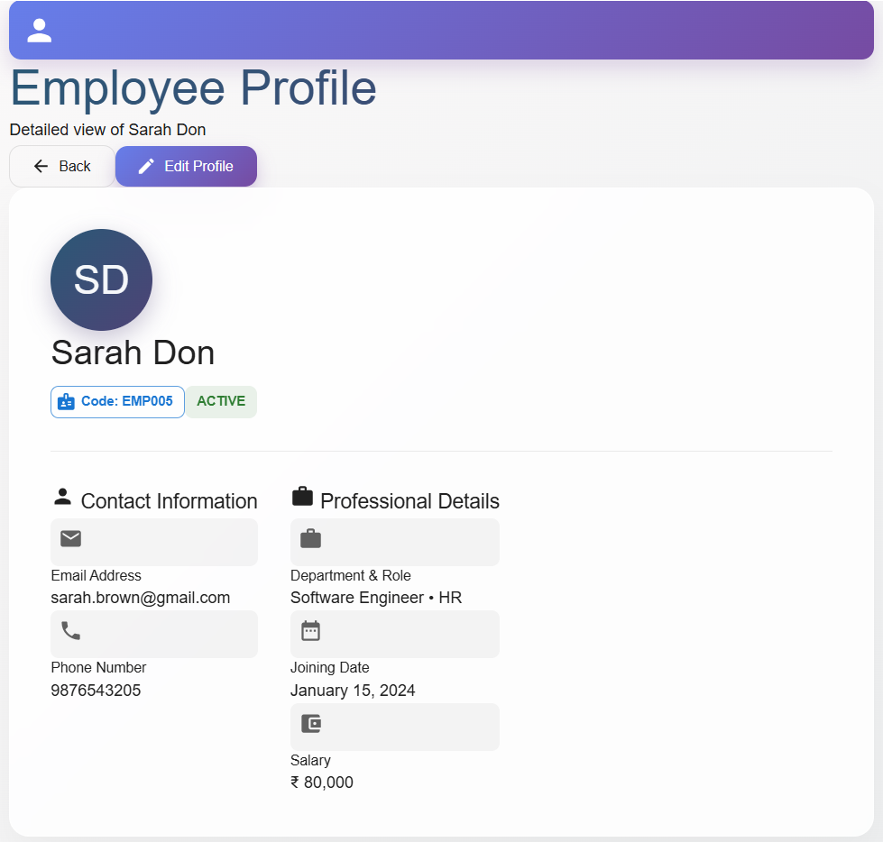
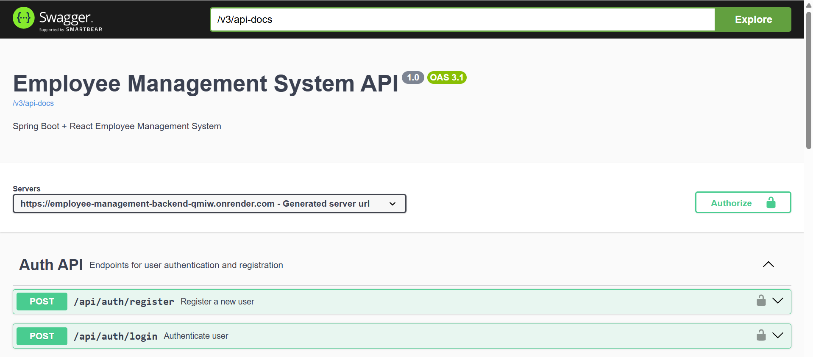
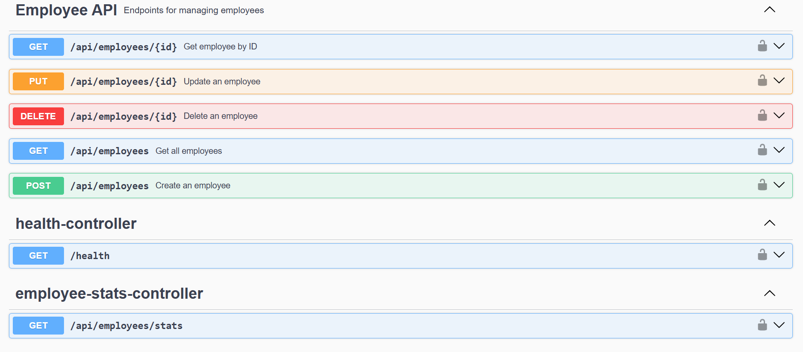
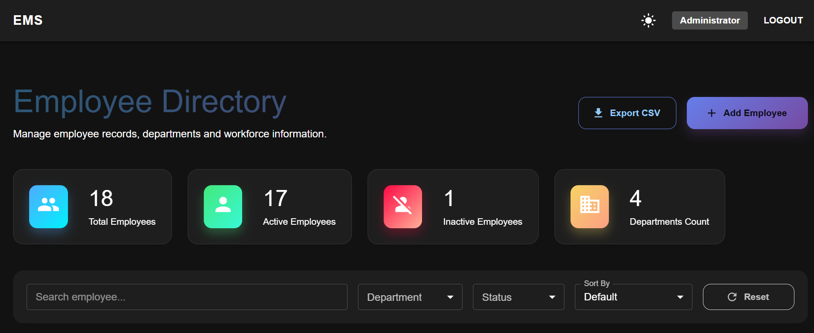

# Employee Management System
A Full Stack Employee Management System built using Spring Boot, React JS, PostgreSQL, JWT Authentication and Docker.

---

## Live Application
### Frontend : 
https://employee-management-frontend-gilt-three.vercel.app/

### Backend API : 
https://employee-management-backend-qmiw.onrender.com

### Swagger Documentation :
https://employee-management-backend-qmiw.onrender.com/swagger-ui/index.html

---

## Project Overview
Employee Management System is a full-stack web application developed to manage employee information efficiently.

The application provides secure authentication, employee management, search and filtering capabilities, role-based authorization, dashboard statistics, API documentation, and deployment to a live production environment.

The project follows a modern architecture using React JS as the frontend, Spring Boot REST APIs as the backend, PostgreSQL as the database, and cloud deployment using Vercel, Render, and Supabase.

---

## Architecture Diagram



### Application Flow
React JS (Vercel)
↓
Spring Boot REST API (Render)
↓
PostgreSQL Database (Supabase)

---

## Key Highlights
- Developed Full Stack Employee Management System
- Implemented JWT Authentication & Authorization
- Implemented Role Based Access Control (ADMIN / EMPLOYEE)
- Developed Employee CRUD Operations
- Implemented Search, Filter and Sorting Functionality
- Implemented Pagination for Large Datasets
- Implemented Dashboard Statistics API
- Implemented Global Exception Handling
- Implemented Logging using SLF4J
- Integrated Swagger/OpenAPI Documentation
- Deployed Frontend on Vercel
- Deployed Backend on Render using Docker
- Integrated PostgreSQL Database hosted on Supabase

---

## Features
### Authentication
- JWT Authentication
- Login & Logout
- Protected Routes
- Token-Based Authorization

### Employee Management
- Create Employee
- View Employee
- Update Employee
- Delete Employee

### Search & Filtering
- Search by Name
- Search by Email
- Search by Department
- Search by Designation

### Sorting
- Employee Code
- First Name
- Last Name
- Joining Date
- Salary

### Dashboard
- Total Employees
- Active Employees
- Inactive Employees
- Department Statistics

### Other Features
- Pagination
- Global Exception Handling
- Swagger Documentation
- Logging
- Responsive UI

---

## Tech Stack
### Frontend
- React JS
- Material UI
- Axios
- React Router

### Backend
- Java 17
- Spring Boot
- Spring Security
- JWT
- JPA / Hibernate
- Maven

### Database
- PostgreSQL
- Supabase

### Deployment
- Vercel
- Render
- Docker

---

## Screenshots
### Login Page



---

### Dashboard


---

### Employee List


---

### Add Employee


---

### Edit Employee


---

### Employee Details


---

### Swagger Documentation
### Authentication APIs



### Employee APIs




## Dark Mode Support



---

## Demo Credentials
### Administrator
Username: admin
Password: admin123

### Employee
Username: employee
Password: employee123

> Note:
> Demo credentials are provided only for project evaluation purposes.

---

## Source Code
### Frontend Repository
https://github.com/venkyslm/employee-management-frontend

### Backend Repository
https://github.com/venkyslm/employee-management-backend

---

## Deployment Architecture
Frontend (Vercel)
↓
Backend API (Render)
↓
PostgreSQL Database (Supabase)

---

## 🚀 How to Run Locally
### Backend

```bash
git clone https://github.com/venkyslm/employee-management-backend.git
cd employee-management-backend
```

Configure environment variables:
```properties
DB_URL=your_database_url
DB_USERNAME=your_username
DB_PASSWORD=your_password
JWT_SECRET=your_jwt_secret
```

Run:
```bash
mvn clean install
mvn spring-boot:run
```

Backend:
```text
http://localhost:8080
```

Swagger:
```text
http://localhost:8080/swagger-ui/index.html
```

---

### Frontend
```bash
git clone https://github.com/venkyslm/employee-management-frontend.git
cd employee-management-frontend
npm install
```

Create `.env`:
```properties
VITE_API_BASE_URL=http://localhost:8080/api
```

Run:
```bash
npm run dev
```

Frontend:
```text
http://localhost:5173
```
---

## Future Enhancements
- Employee Profile Picture Upload
- Email Notifications
- Export Employee Reports
- Advanced Dashboard Analytics
- Audit Logging
- Password Reset Functionality

---

## Author
**Venkatesan M**
Full Stack Java Developer

LinkedIn:
https://www.linkedin.com/in/your-linkedin-profile

GitHub:
https://github.com/venkyslm

---

## License
This project is developed for learning, portfolio and demonstration purposes.

